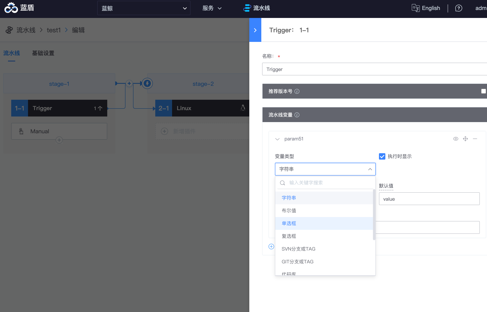
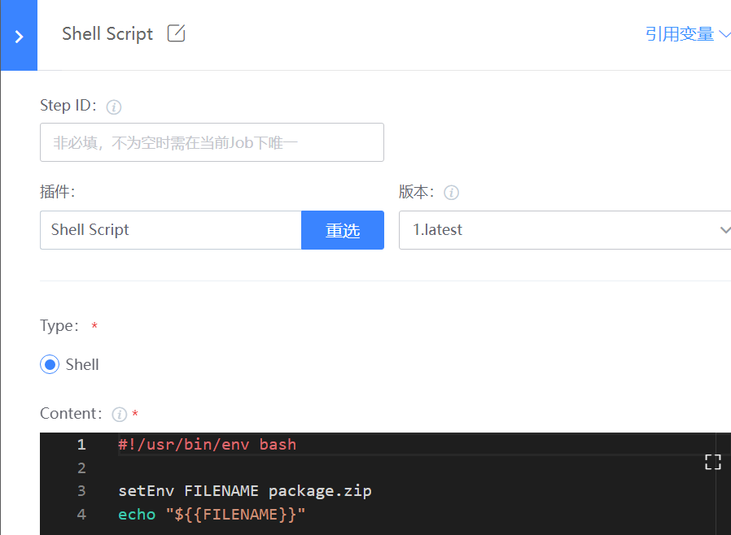
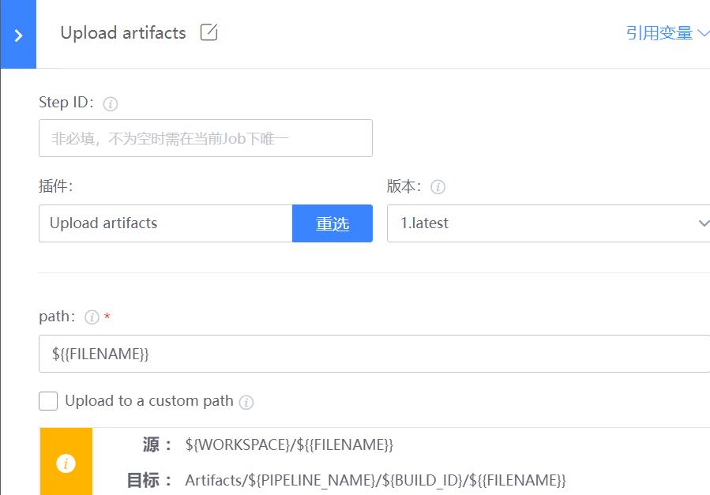
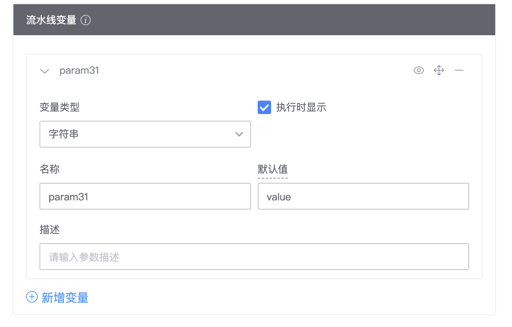
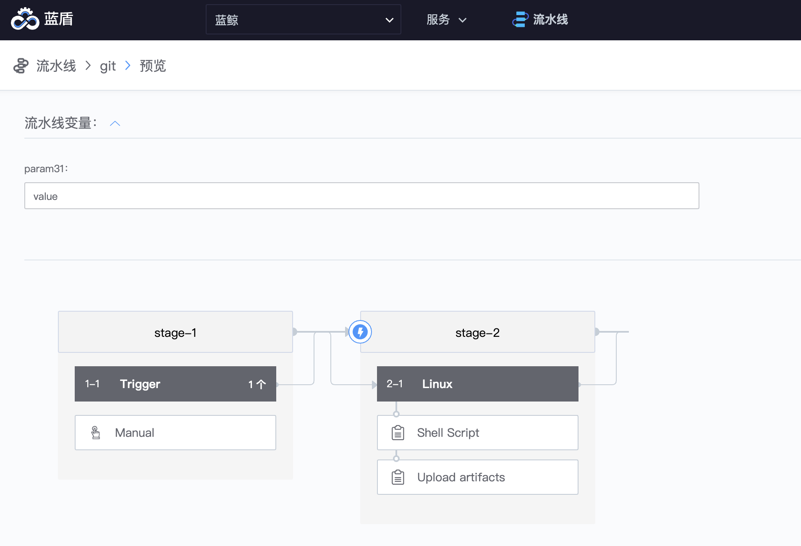

# Variables

## 在流水线中定义变量

### 在编排流水线时自定义变量

在编辑流水线页面点击 Job1-1，可以添加流水线变量。


### 在流水线插件中设置变量

如果你在 bk-ci 中开发了自己的流水线插件，可以在插件的 task.json 中定义 output 字段，这样也可以在运行该插件时声明这些变量。

### 通过 Bash 插件设置变量

您可以通过 Shell Script 插件中的 setEnv 函数设置插件间传递的参数，用法如下：

```bash
#!/usr/bin/env bash
# setEnv "FILENAME" "package.zip"
# 然后在后续的插件的表单中使用${{FILENAME}}引用这个变量
```



## 在流水线中引用变量

你可以在任意的插件表单中使用通过上面介绍的方式定义的变量，引用方式为 ${{KEY}}，例如：

> 示例中，就在“Upload artifacts”插件中的某字段中引用了 ${{FILENAME}} 这个变量。

## 在手动触发流水线时设置变量值

1. 在编辑流水线时定义了流水线变量，并开启了“执行时显示”选项时，则会在运行流水线后进入**流水线预览页**；



2. 进入预览页，你可以再次编辑你的变量 value 并运行流水线。



> 变量 Key 在执行时不可修改，只能修改 value。

## 接下来你可能需要

- [预定义变量列表](../FAQS/Variables.md)
