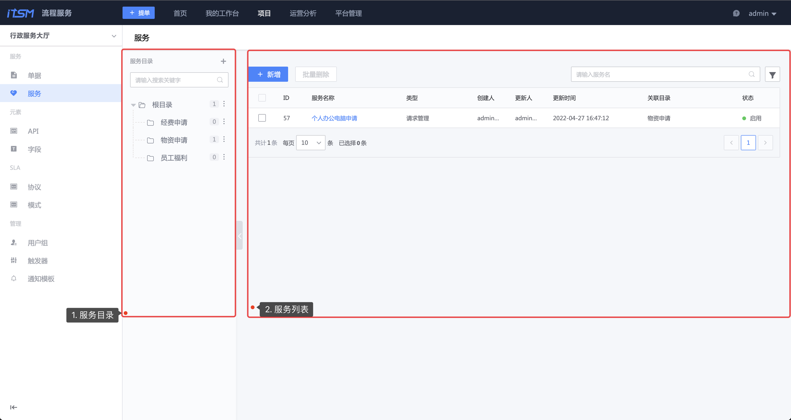
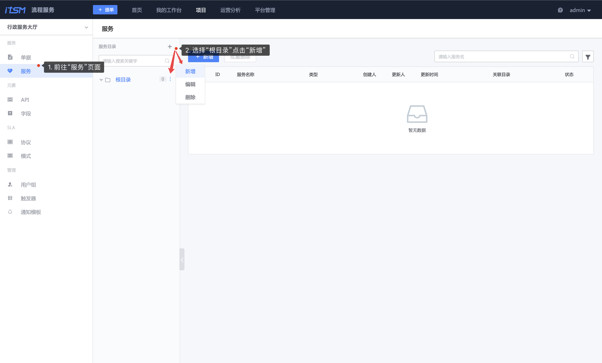
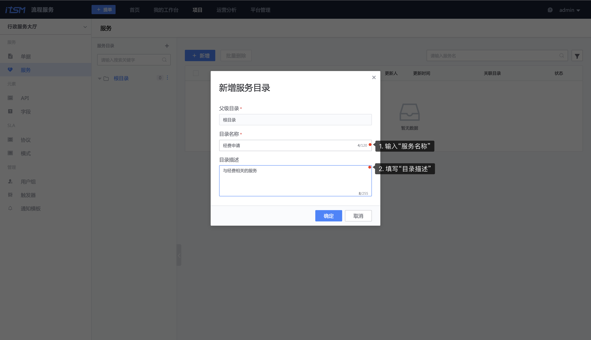
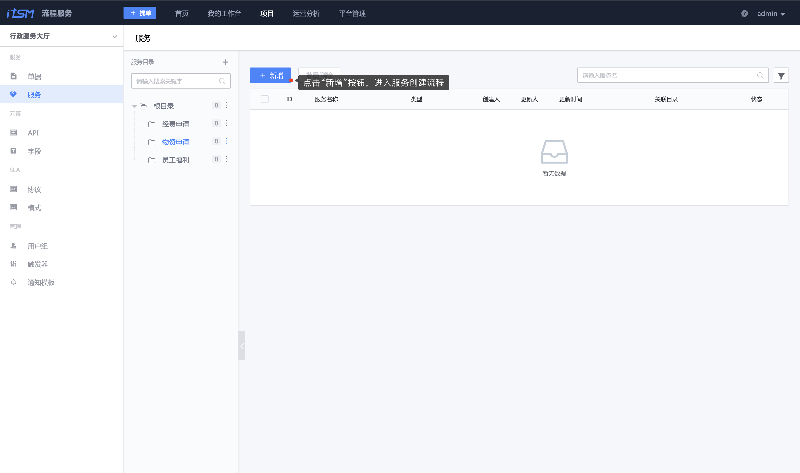
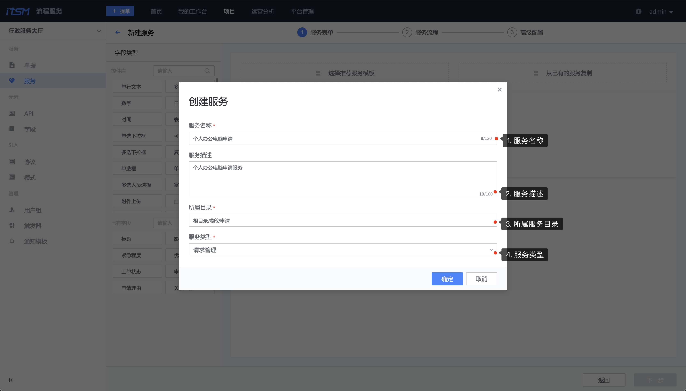
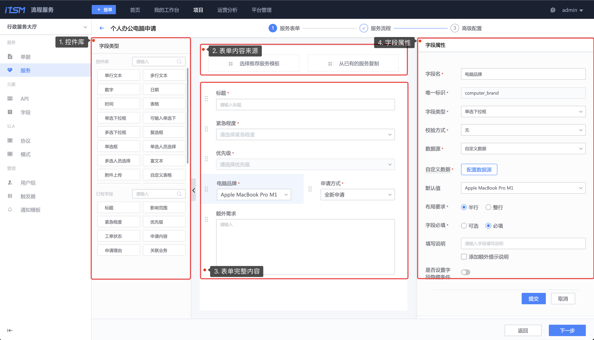
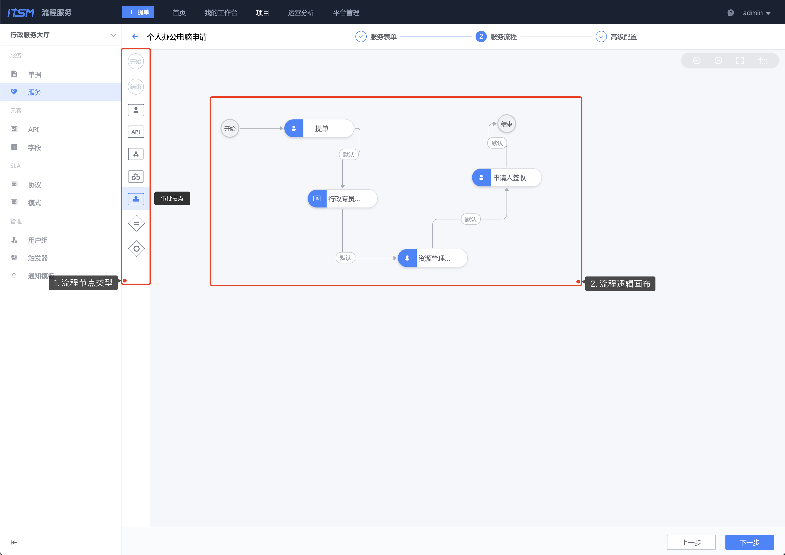
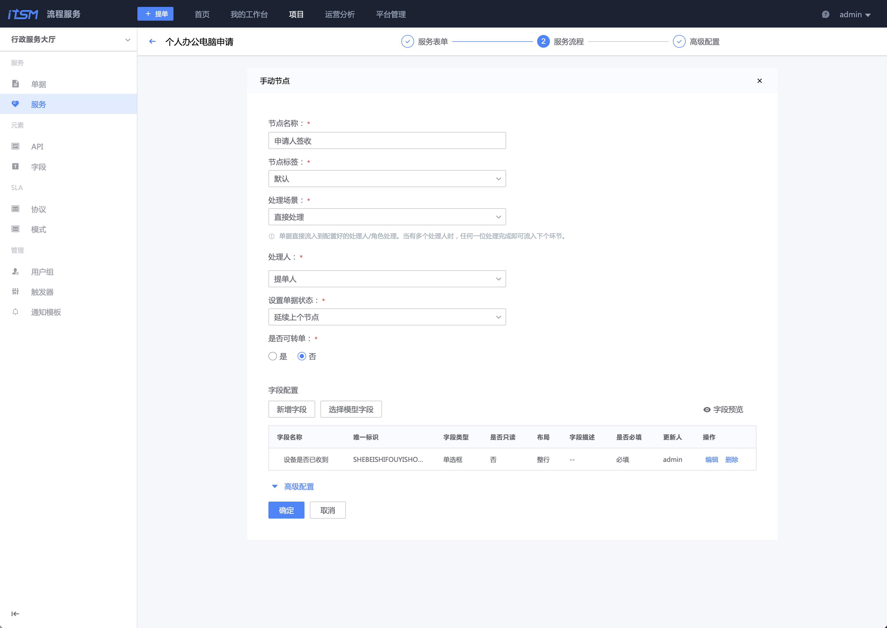
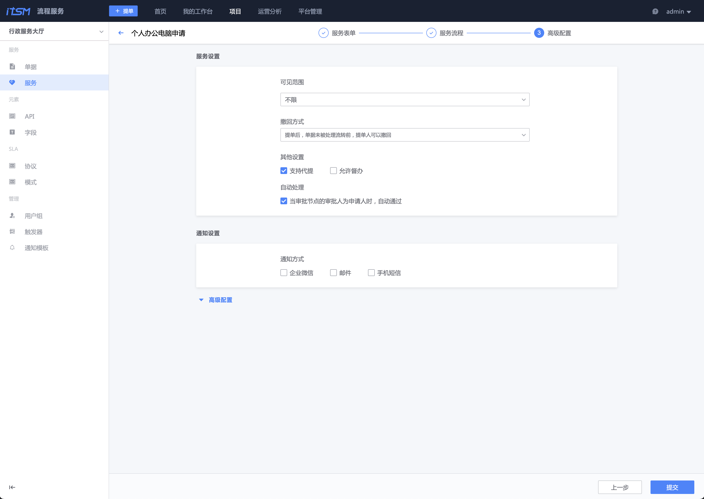
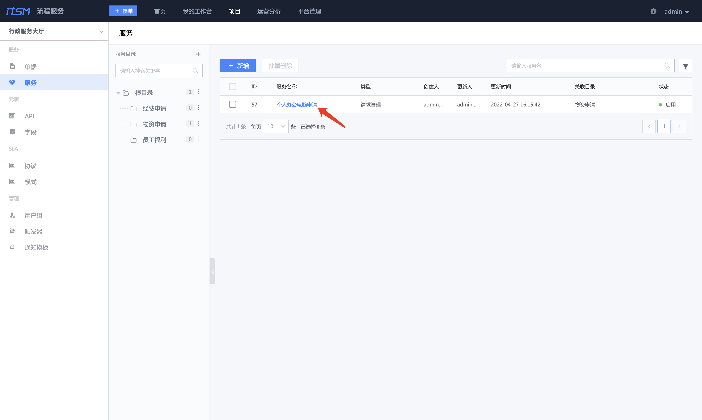

## 服务管理

「服务」由“表单”和“流程”组合而成！“表单”是服务团队根据不同的服务所需用户反馈的信息收集纸，“流程”则是一套完整服务的各个处理环节的定义；有了用户的需求表单，加上服务的处理流程，就能够将服务在线上自动化运行起来。

1. 服务目录

   项目可以根据自己团队的服务分类诉求，创建不同分类的目录来管理服务。

2. 服务列表

   显示各个目录下的服务列表

### 创建服务目录

进入项目下的“服务”页面，在左侧服务目录中的“根目录”右侧点击 `新建` 按钮

- 父级目录

    自动选择当前新建的目录所属的父级目录

- 目录名称

    填写目录的名称，一般用于代表一类服务的名称

- 目录描述

    对该服务目录的描述说明

### 创建服务

进入项目下的“服务”页面，点 `新增` 按钮进入服务创建流程

- 服务名称

    服务的名称，用于直观代表该服务提供的目标，如图中所示“申请个人办公电脑”的服务

- 服务描述

    更详细的服务完整介绍说明

- 所属目录

    该服务所属的目录（即上一步我们规划的服务目录）
    
- 服务类型

    对服务的分类，如 `请求管理` `变更管理` `事件管理` `问题管理` 等等

填写完服务的名称、描述等基础信息后，就会进入服务的 `表单设计` 环节；这个表单就好像我们去到当地户政大厅的服务窗口时，政务人员会根据不同的服务类型递给我们对应的 `申请表` 类似；它主要用于搜集服务提供方为满足需求方目标的所需信息，比如需求方对该需求的紧急程度？申请物资时需要什么类型？是否有额外要求？等等...

通常，该表单也表达了服务提供方所能提供的服务能力范围，在这个服务范围内，需求方可以按需填写并提交。

- 控件库

  提供各种不同类型的字段控件，用户可按场景需要进行选择

- 表单来源

  - 选择推荐服务模板

    可以通过选择系统预设、或别人分享的服务模板来快速创建表单创建服务表单

  - 从已有的服务复制

    从项目中已有的服务中克隆表单信息

- 表单内容

  展示表单的完整内容区域

- 字段属性

  设置表单字段的属性

配置完服务表单后点下一步进入到服务的“流程配置”步骤，用户根据服务的处理步骤进行流程节点的设计；

- 流程节点类型

  可用的流程节点类型

  - 手动节点

    该类型提供人工手动进行处理反馈场景，用户可以在节点内自定义设置反馈的信息字段，当流程运转到该节点时，处理人需要人工进行反馈确认才能继续运行。

  - API 节点

    该类型提供流程调用其他第三方系统 API 的能力，常用于某些自动处理场景，如设置某个资源的属性、打开某个系统的功能开关等等

  - 标准运维

    对接蓝鲸标准运维的流程，可配置用户在标准运维中创建的流程执行具体的任务

  - 蓝盾（暂未开放）

    对接蓝盾（蓝鲸 CI）的流水线，暂未开放

  - 审批节点

    面向审批场景的特定类型节点，提供 `或签` `会签` 等能力

  - 并行网关

    用于设置多个需要“同时并行处理的节点，常用于某些在特定流程环节需要多个团队同时处理的场景

  - 汇聚网关

    用于汇聚多个并行处理步骤的节点，可以将各个节点的处理结果进行汇聚处理等场景

- 流程逻辑画布

  串连各个流程步骤，组合成一个完整的流程

_审批节点示例_

_手动节点示例_

_手动节点示例_

设计好服务流程步骤后，点击“下一步”进入到最后的通用服务配置环节

- 可见范围

  设置可以看到该服务提单入口的用户范围

- 撤回方式

  设置用户提单后是否可以撤回，以及以何种方式撤单

- 支持代提

  设置是否可以由其他人代为提单

- 允许督办

  设置监督单据的用户，督办人可以在流程运转过程中进行关键环节的提醒和通知

- 自动处理

  设置当流程处理中的审批节点如果出现提单人时，可自动标记为 `通过`

- 通知方式

  设置提单后的状态和进展通知渠道

至此，一个完整的服务就创建完成了。