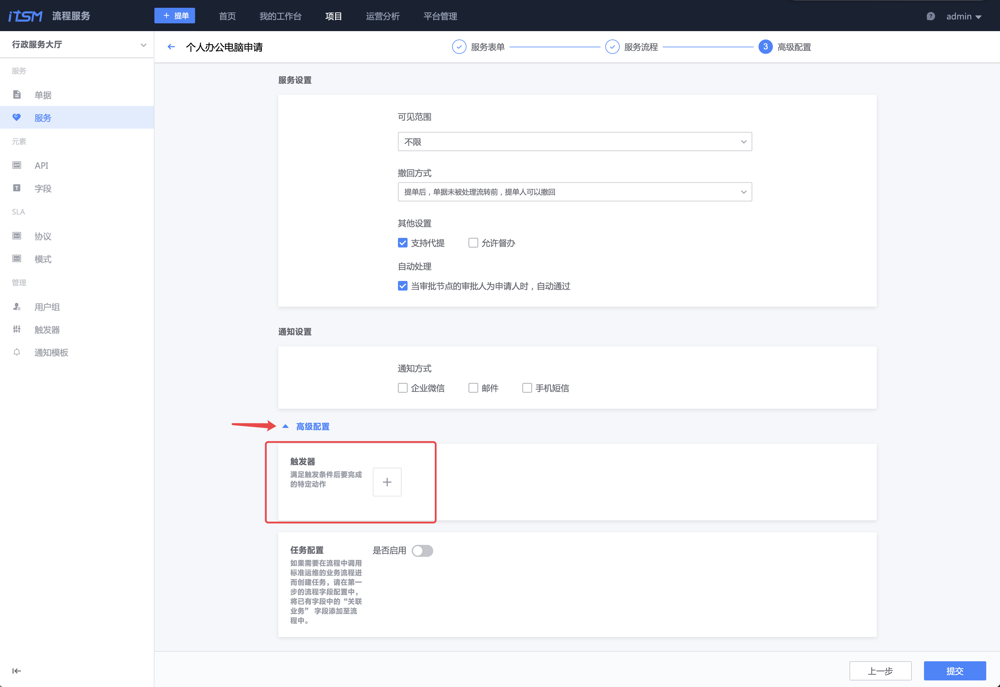
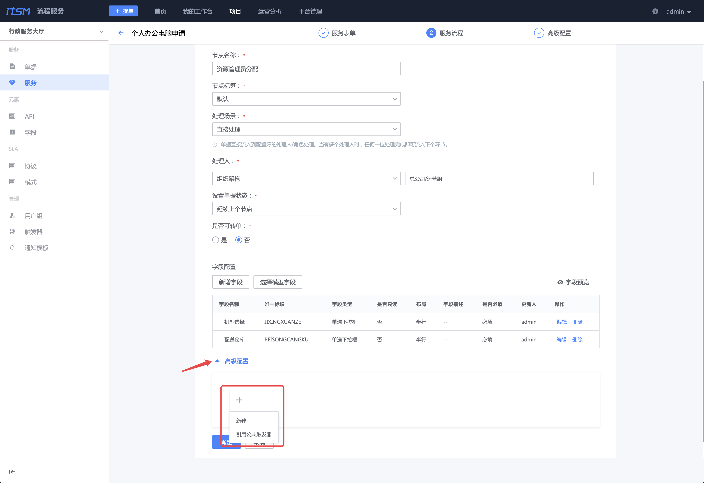
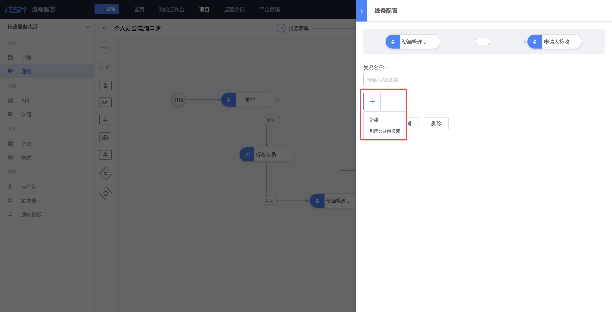
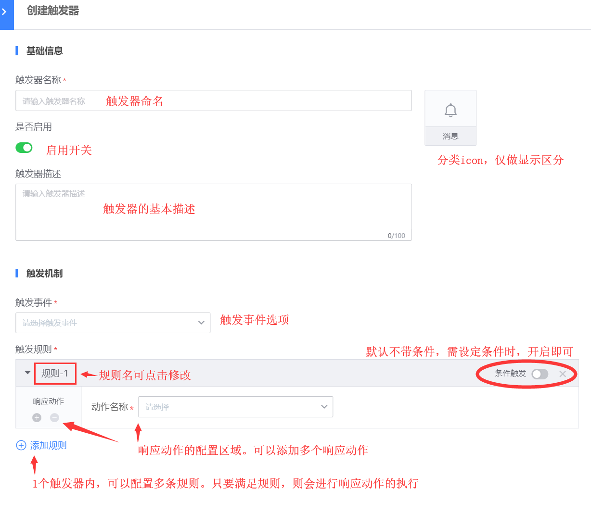
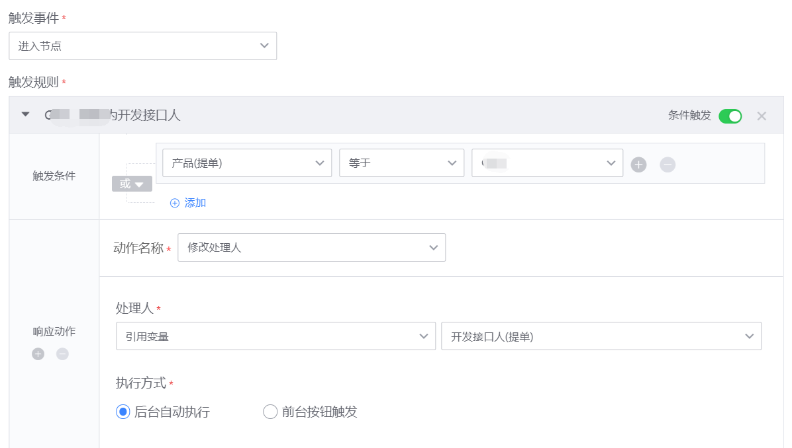
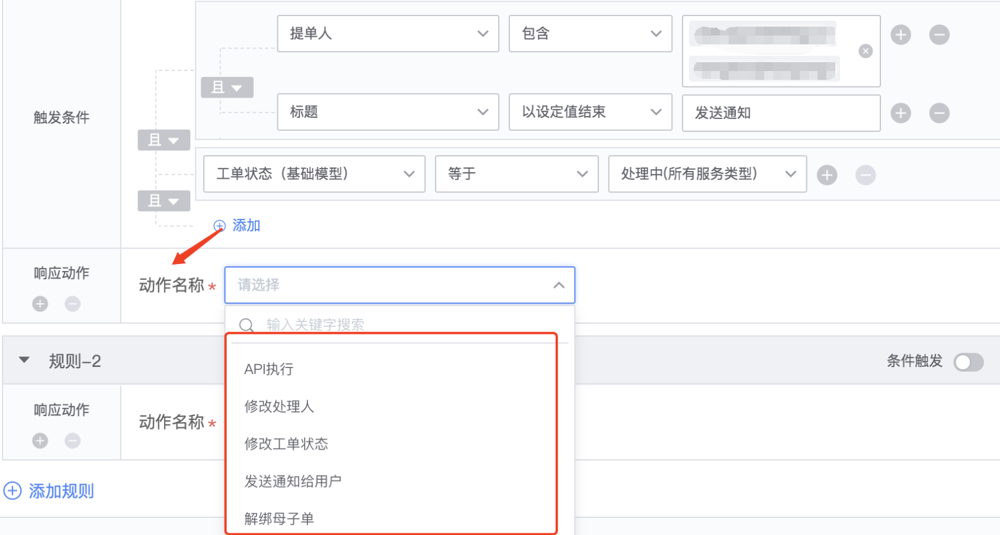
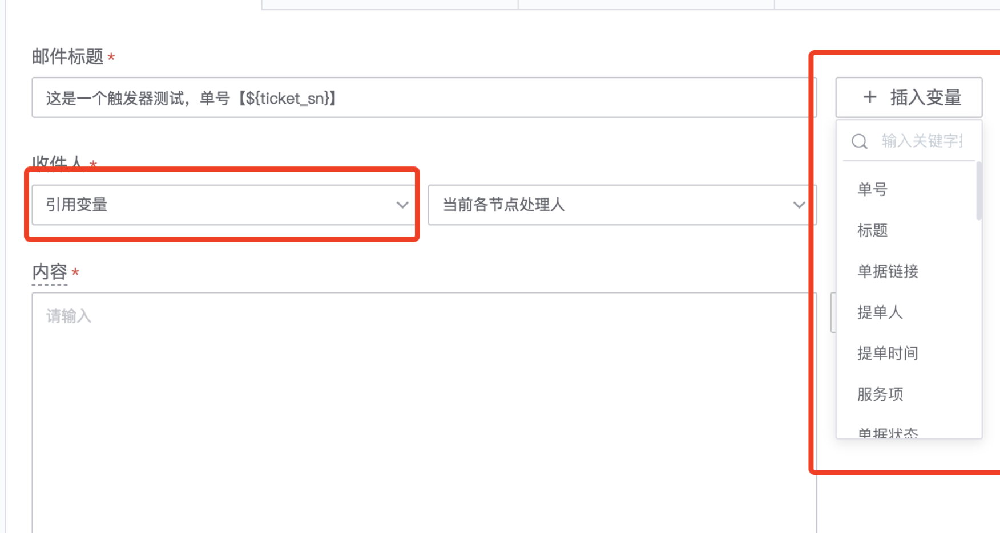
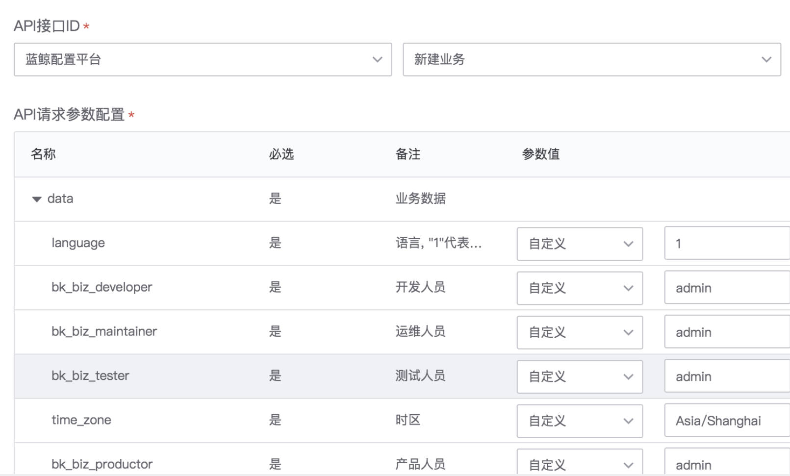

## 触发器管理

由触发事件，触发规则以及响应动作组成的一套机制，用来满足在流程场景中的个性化业务逻辑。

例如：

1.当完成某个节点后，希望调用指定 API 通知第三方系统。

2.进入到某个节点时，根据前序节点中特定字段的不同值，可以更改当前节点的处理人。

3.关键节点完成之后，希望自动触发额外通知到特定人。

<table>
    <tr>
        <th rowspan="1">触发事件大类</th>
        <th rowspan="1">触发事件小类</th>
        <th rowspan="1">触发规则方式</th>
        <th rowspan="1">响应动作</th>
        <th rowspan="1">配置入口</th>
    </tr>
    <tr>
        <td>单据类</td>
        <td>创建单据 关闭单据 终止单据 挂起单据 恢复单据 撤销单据</td>
        <td rowspan="4">方式1：默认触发 方式2：条件触发</td>
        <td rowspan="4">API执行 修改处理人 修改工单状态 发送通知给用户 解绑母子单</td>
        <td>流程设计>流程启用设置</td>
    </tr>
    <tr>
        <td>节点类</td>
        <td>进入节点 离开节点 节点中分派单据 节点中认领单据 节点中转单</td>
        <td>流程设计>定义与配置流程>节点配置>高级配置</td>
    </tr>
    <tr>
        <td>线条类</td>
        <td>进入分支</td>
        <td>流程设计>定义与配置流程>流转条件配置</td>
    </tr>
     <tr>
        <td>任务类 （启用任务模块功能才适用）</td>
        <td>创建任务之后 删除任务 执行任务之前 执行任务之后 任务完成之后</td>
        <td>任务模板>高级配置</td>
    </tr>
</table>

触发器根据其应用的具体位置，可分为以下几种类型：

-   公共触发器：
    可以调用通用的参数，实现一个共享基础模型中的基础配置，可以在同模型下的流程实例中引用。这里的引用，是指将公共触发器中的配置复制一份到引用位置，可以根据具体的需要进行修改。修改后的内容并不会更新至被引用的公共触发器中。公共触发器的管理和维护一般由超级管理员来负责。

    引用原则：与引用位置相匹配的触发器。如：在节点中引用触发器，只能引用“触发事件类型=节点信号”的公共触发器。在流转条件配置时引用触发器，只能引用“触发事件类型=线条信号”的公共触发器。系统会根据引用位置来自动过滤不适用的公共触发器。*

- 流程触发器：在流程单据全局事件下配置的触发器，在流程中的触发器引用公共触发器的时候，必须保持基础模型一致或者基础模型为空。

  

流程触发器入口

- 节点内触发器：发生在节点实例中的触发器

  

节点触发器入口

- 线条触发器：进入到某个线条实例中的触发器

  

线条触发器入口

### 创建触发器

触发器的应用机制：当单据发生了“触发事件”，按照“触发规则”，进而执行“响应动作”。

-   单个触发器只能匹配一个触发事件。

-   触发规则可以设置多条，只要规则满足，都会响应对应规则下的动作。

-   规则默认不带条件触发：表示达到事件即可以直接执行响应动作。条件触发配置支持两个层级的条件组配置，可以根据用户的需求，选择对应的关系表达式。

-   响应动作的类型目前均为系统内置。响应动作的执行方式分为两种：

    1.后台自动执行：表示触发器被激活，直接执行，无需前台用户干预。

    2.前台按钮触发：触发器被激活之后，会生成一条按钮记录，展示在单据页面，由用户手动触发。触发次数为一次，表示只能执行一次。多次，表示按钮一直存在，可以多次点击执行。

节点触发器配置4

发送通知：可以配置通知方式和内容，是一个组合的响应插件。

响应动作

响应动作-发送通知

API 执行，根据系统 API 配置，填写 API 的请求参数。

响应动作-API执行
