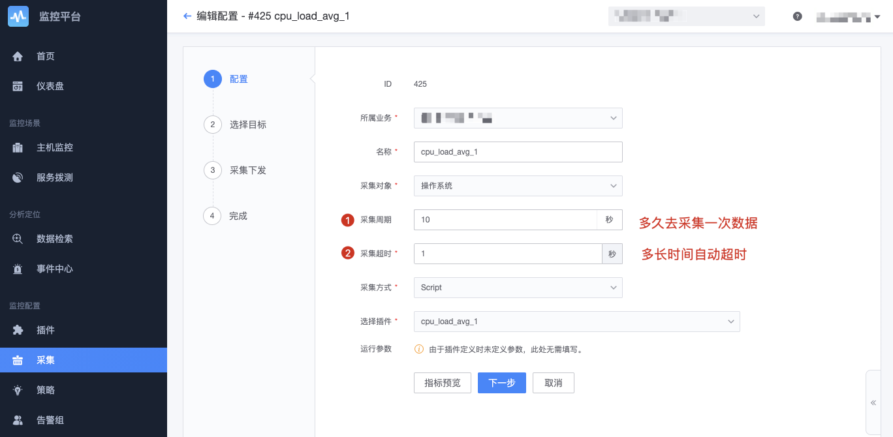
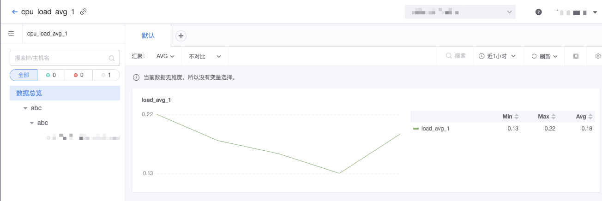
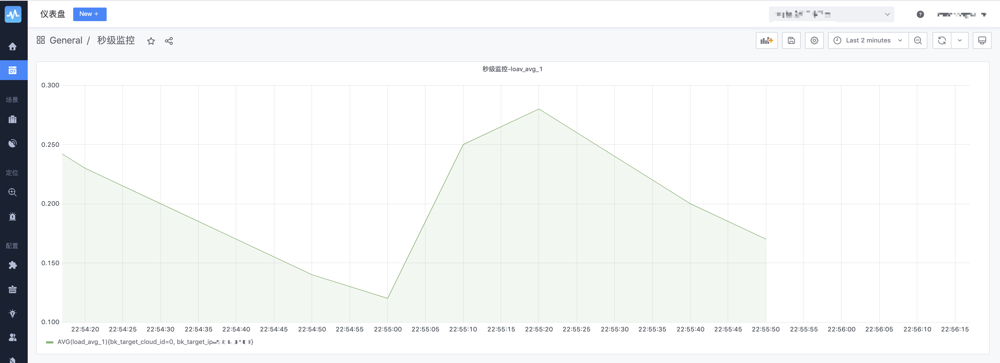
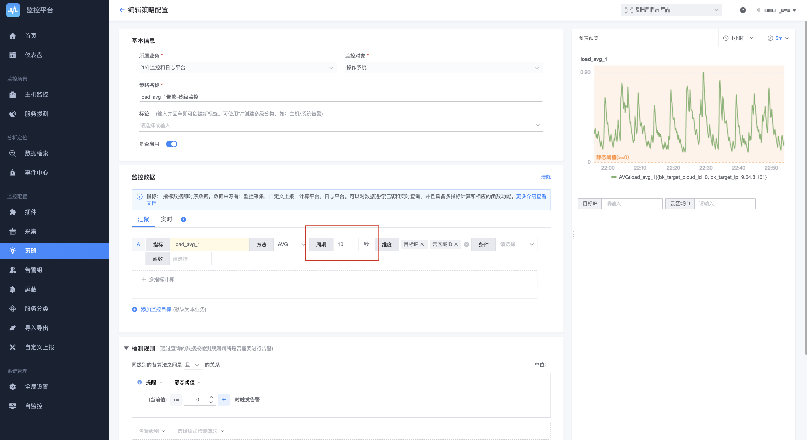
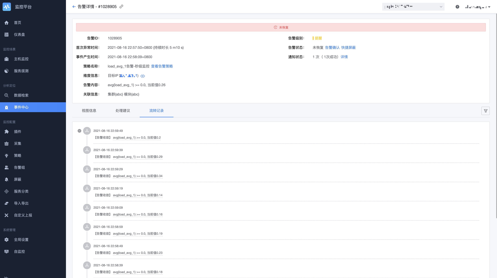

# 1.什么是秒级监控

**秒级监控**，是指监控数据按照秒级的周期对目标数据进行采集，并对取回的数据按照秒级的周期进行数据展示和告警检测。

# 2.秒级监控的使用场景

- 核心业务数据
- 业务压测场景
- 性能监控场景
- 关键链路监控
- 核心设备数据

# 3.秒级监控的功能

| 分类       | 实现方式                           | 上报周期      | 采集周期                                                     |
| :--------- | :--------------------------------- | :------------ | :----------------------------------------------------------- |
| 操作系统   | 通过采集器采集指标                 | 1 分钟         | 1 分钟采集 4 次，15 秒一个周期，取最大值上报**max(1 分钟内间隔 15 秒共采集 4 次)** |
| 自定义上报 | 通过 HTTP 数据格式上报给 HTTP 数据接口 | 可以低于 1 分钟 | 由上报频率决定                                               |
| 插件采集   | 通过采集器获取用户自定义插件数据   | 最低 10 秒      | 10 秒                                                         |

   采集器周期可以为 1 秒吗？在这里我们综合考虑了使用场景，暂时将操作系统指标定为 1 分钟上报一次，而平台本身是可以支持秒级采集的能力的。

   目前插件采集周期最小限制为 10 秒。因为在某些情况下，采集插件脚本本身执行都会花费几秒的时间，如果将其设置为 1 秒，则会一直采集不到数据，因此，平台方将这个最小取值周期设为了较为 10 秒，可以满足大部分用户的使用场景。但不排除有部分场景，有用户需要使用 1 秒，5 秒，设置是毫秒的采集周期的需求。

#  4.如何使用秒级监控

下面我们实际举例来说明如何使用秒级监控，从数据采集，到数据展示，再到数据告警，我们来一起体验。

## 4.1 采集周期

插件采集使用文档请参考[如何使用监控插件采集指标](https://iwiki.woa.com/pages/viewpage.action?pageId=208085448)，在采集中，我们选择**采集周期为 10 秒**，**采集超时**配置小于 10 秒即可，需要确保脚本在 10 秒能执行完毕

在采集视图中，查看采集上报的数据

仪表盘查看数据

## 4.2 配置告警策略

在告警策略中，选择周期为 10 秒，策略的周期需要大于等于采集周期

## 4.3 查看告警事件

配置告警策略后，产生告警如下所示

