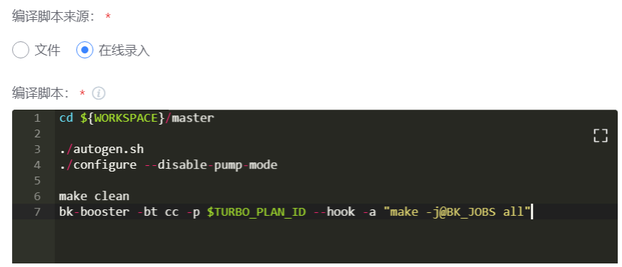

# 在流水线中使用 Linux C/C++ 编译加速

> Linux C/C++ 编译加速支持 pch、gcov、分布式预处理等功能<br/>
> 如下教程指引如何配置并进行 Linux C/C++ 编译加速

## 准备工作

1. 定制一个加速方案 [加速方案管理](../Services/turbo_plan.md)

## Step1 修改编译脚本

假设原编译脚本为：

```bash
cd ${WORKSPACE}/master

./autogen.sh
./configure --disable-pump-mode

make clean
make -j all
```

可见，前面部分的命令在做一些准备工作，实际编译指令是：

```bash
make -j all
```

我们只需要修改这句，用加速器来执行编译指令，即可获得加速。

```bash
bk-booster -bt cc -p $TURBO_PLAN_ID --hook -a "make -j@BK_JOBS all"
```

其中 bk-booster 是插件提供的加速器，用来启动加速
命令中的参数含义分别为

- -bt cc，指定场景为 cc，用于 linux 下的 c/c++编译。
- -p $TURBO_PLAN_ID，指定方案 ID，在“Turbo 编译加速”插件中，会默认注入选中的方案的 ID。
- --hook，开启命令 hook，会自动劫持 gcc/clang 等编译器，实现加速。
- -a "make -j@BK_JOBS all"，指定要执行的编译命令，其中 @BK_JOBS 作为占位符，在运行时会自动替换为推荐的并发数量。

## Step2 打开流水线，Linux Job 下添加 “Turbo 编译加速”插件


> 注意：这个步骤之前需添加拉代码插件

## Step3 选择已注册好的加速方案


## Step4 配置编译脚本

编译脚本可以使用文件管理，提交到代码库，流水线中仅需填写脚本文件的相对路径即可：


也可以将编译脚本配置到插件里：




配置完毕后，执行流水线，即可开始加速。
