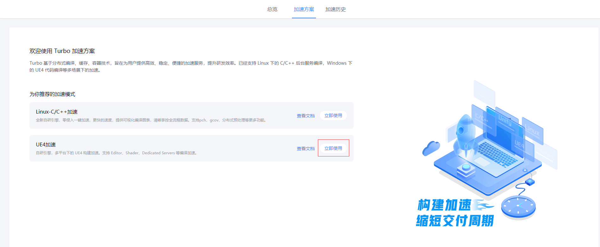
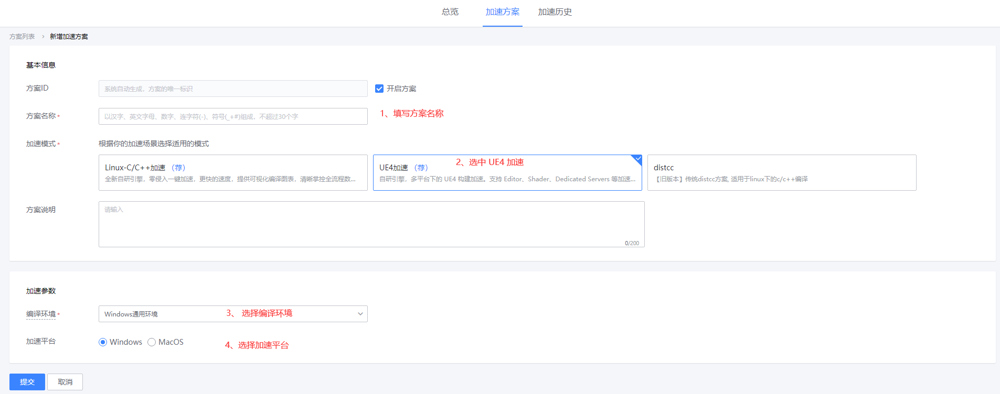

# UE4 编译加速

> 如下教程指引如何配置并进行 UE4 编译加速

## 一、获得加速方案 ID

若已有满足需求的加速方案，在[方案列表](../Services/turbo_plan_list.md)快速复制方案 ID，或点击方案名称进入查看页面复制方案 ID

### Step1 访问 BKCI，导航栏进入服务 → 编译加速

首次时，进入页面如下，点击立即使用进入方案定制页面：

### Step2 填写方案配置

方案配置包括：

- 方案名称：作为标识名称，可以填写诸如“xxx 个人加速”、“每日构建加速”、“构建机出包加速”等等。
- 加速模式：选择要创建的加速模式，一旦创建，加速模式不可修改。
- 方案说明：可以写一些备注或者说明在这里。
- 编译环境：根据实际场景选择编译环境
- 加速平台：根据实际场景选择加速平台

### Step3 提交注册，获得专属方案 ID

点击提交后，会生成一个你专属的方案 ID，这个 ID 后续也可以在“加速方案”→点击方案名字，进入详情页面查询到。

方案 ID 是使用加速的凭证，里面包含了你的环境信息、配置信息、权限信息。**请妥善保管好你的方案 ID，不要随意透露给他人。**

## 二、使用 UE4 编译加速

> - UE4 工具包中有详细的使用指引，下载并解压工具包后，按照 readme.pdf 中的指引进行配置
> - 在查看加速方案界面，根据使用的 UE4 版本选择工具包下载

1. 根据 ue4 版本，下载对应的加速工具包
2. 拷贝工具包到 ue4 项目中，作为编译工具链
3. 根据文档指引，合并或修改部分 ue4 源文件，使其构建环节能够接入加速
4. 根据文档指引，配置加速方案 id，并启用加速配置
5. 重新生成 ubt 和 ue4 editor，发起构建并观察效果
