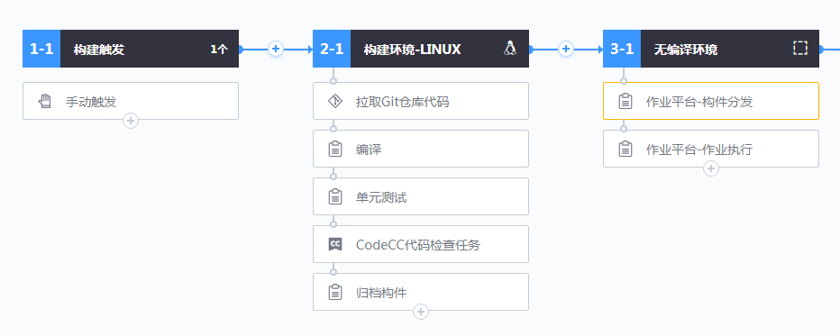
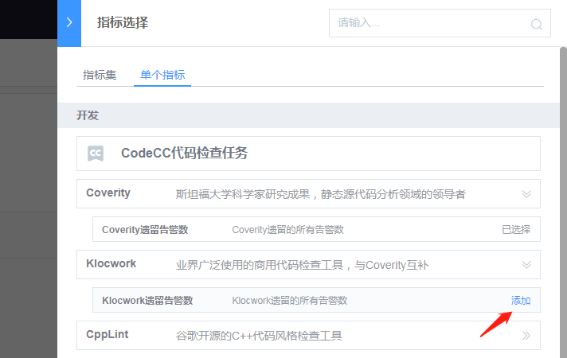
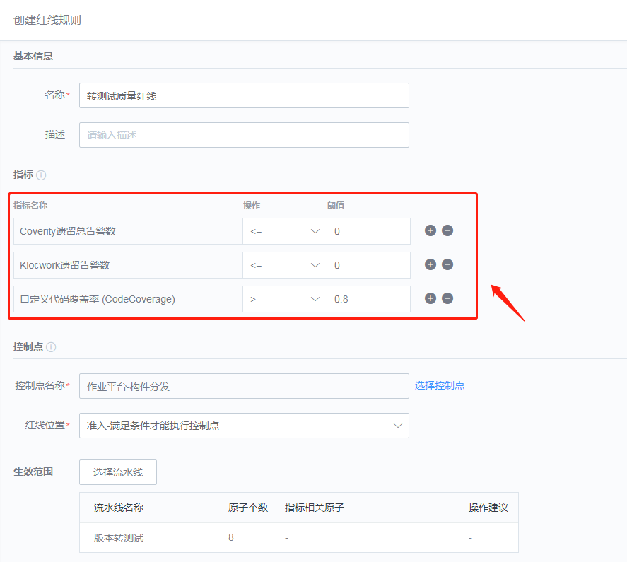
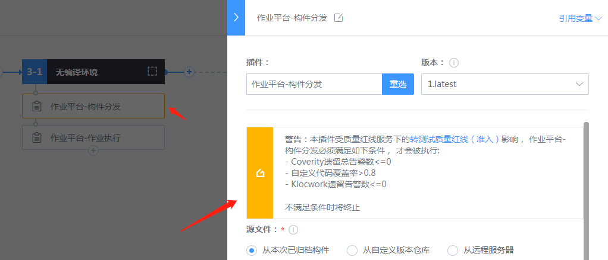
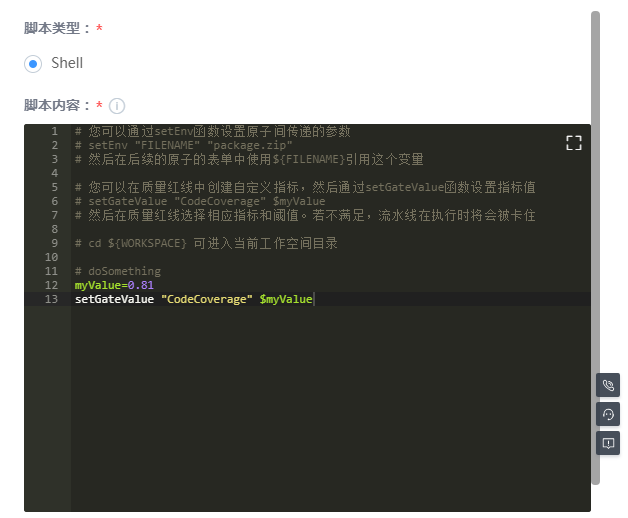

##1、版本转测/发布的质量要求

版本转测/发布上线是研发流程的一个关键节点。以转测为例，在此之后主导角色由开发转为测试，代码一般不再允许随意更改。因此，这个节点的质量控制非常重要，一般会进行单元测试、自动化测试用例、缺陷和安全问题代码检查等。如果代码覆盖率过低、自动化用例执行失败、代码检查告警过多，说明代码质量堪忧，不宜进行转测。

下面说明一下如何使用质量红线来控制版本转测/发布的质量，以某后台项目转测试为例。

##2、新建流水线

新建一条转测试流水线，包含了编译、单元测试、代码检查、作业平台-构件分发等原子。作业平台-构件分发是测试环境部署的关键，需要在这里创建质量红线。

##3、选择代码检查指标

在质量红线中选择相应的代码检查指标，比如可以选择Coverity告警数清零、Klocwork告警数清零。

##4、选择脚本任务指标（自定义指标）

对于单元测试代码覆盖率，目前没有现成的指标，可以自定义一个指标。例如下面定义了一个叫做CodeCoverage的float型指标。

此时就能在质量红线创建过程中选择到这个指标了。因此在补充其他信息后，可以完成质量红线的创建。

在流水线也能够看到具体的质量红线要求。

5、在流水线脚本任务中增加一行

由于脚本任务指标需要用户自己来上报数值，因此需要在流水线中相应的脚本任务中增加一行代码，用来上报定义的CodeCoverage的数值。

6、执行流水线，查看红线效果

最后执行流水线，就能查看红线效果了。如果代码不符合要求，就无法被发布到测试环境。点击“质量红线”，可以查看具体是什么方面不符合要求。

