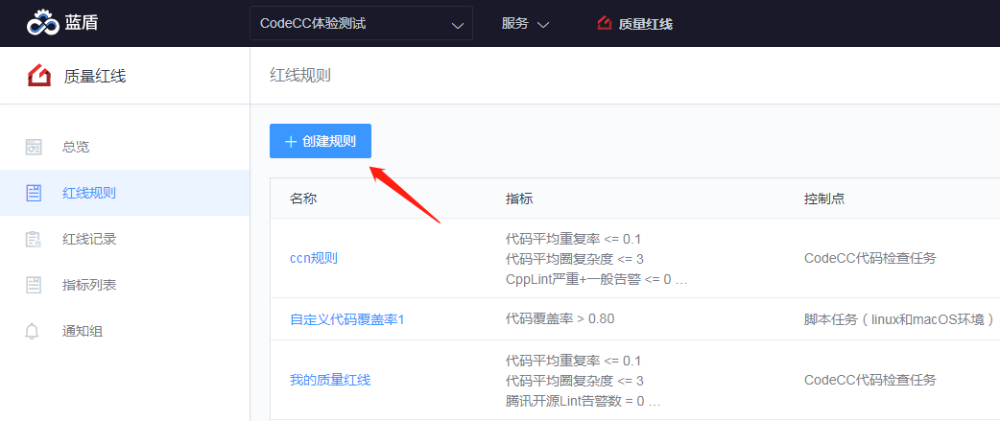
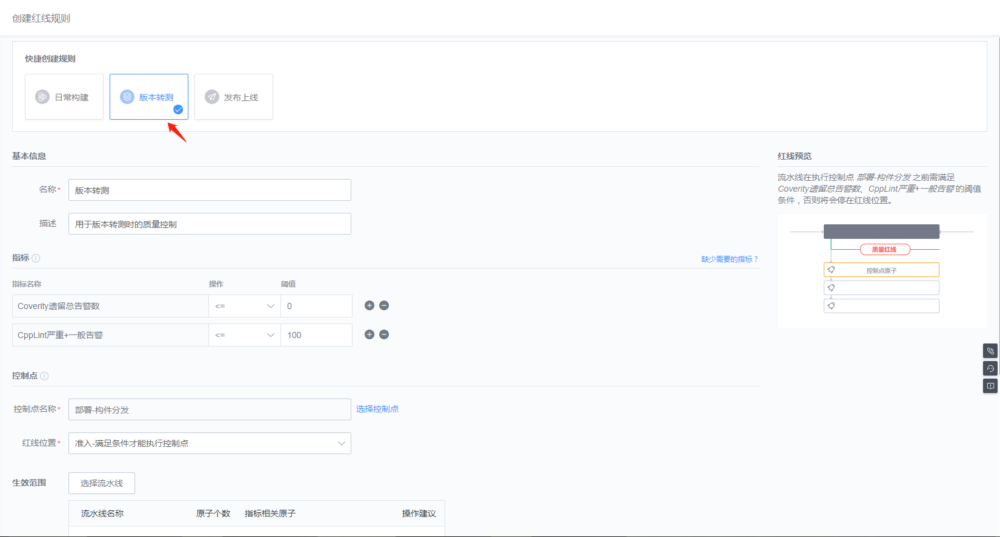
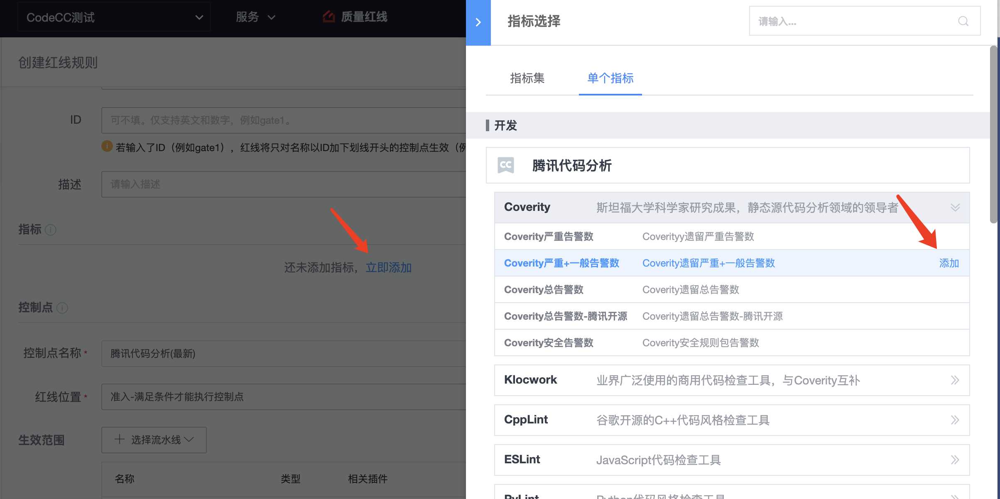
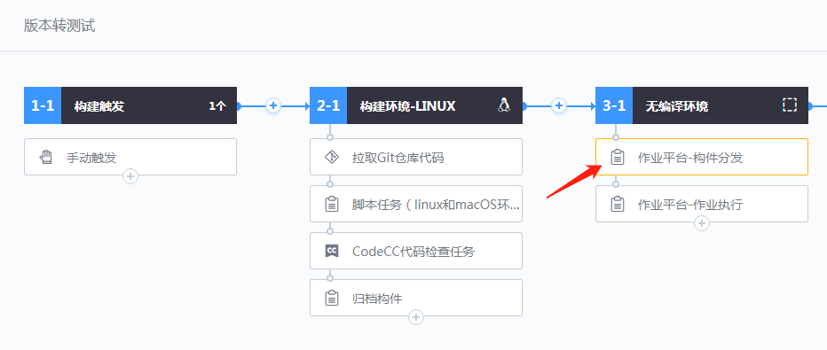
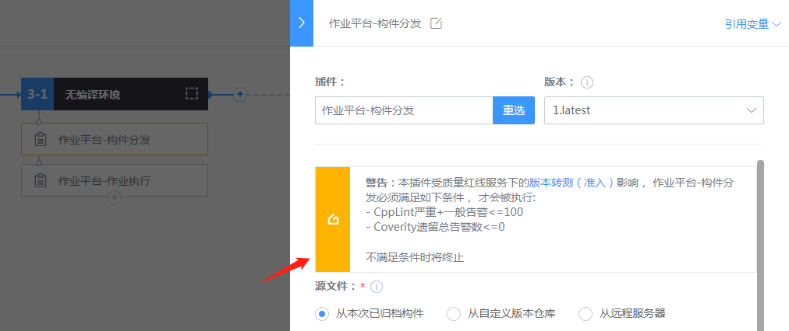

1、创建一条质量红线的规则
1.1、进入质量红线服务
进入质量红线服务，选择创建规则。 

1.2、选择“快捷创建规则”
根据自己的需求，选择“快捷创建规则”中的某一种模板。

例如想要在转测时实行质量红线，可以选择“版本转测”的模板。这时系统会为你自动创建一条规则。

PS：指标和控制点可以根据自己的需求进行修改和调整。如果没有找到需要的指标也可以自定义指标。

1.3、选择“生效范围”
选择“生效范围”，即上述指标阈值条件，对于哪些流水线生效。如果选择的流水线没有产出指标的相关原子/插件，将会进行提示。可以根据提示，前往流水线添加原子/插件。

1.4、选择红线拦截时对流水线的操作
当流水线不满足质量红线定义的质量标准时，此时流水线会在控制点附近停住。我们可以设置让流水线直接失败，也可以设置让质量管理员来进行评审，确定要不要让流水线执行后面的步骤，例如部署到测试环境。

2、执行相关流水线

2.1、流水线的红线展示效果
流水线如果被质量管理员设置了质量红线，流水线中相应控制点将会显示出黄色的边框，点击可以看到质量红线的阈值和期望。

2.2、执行流水线
代码未达到质量标准将无法顺利部署。

