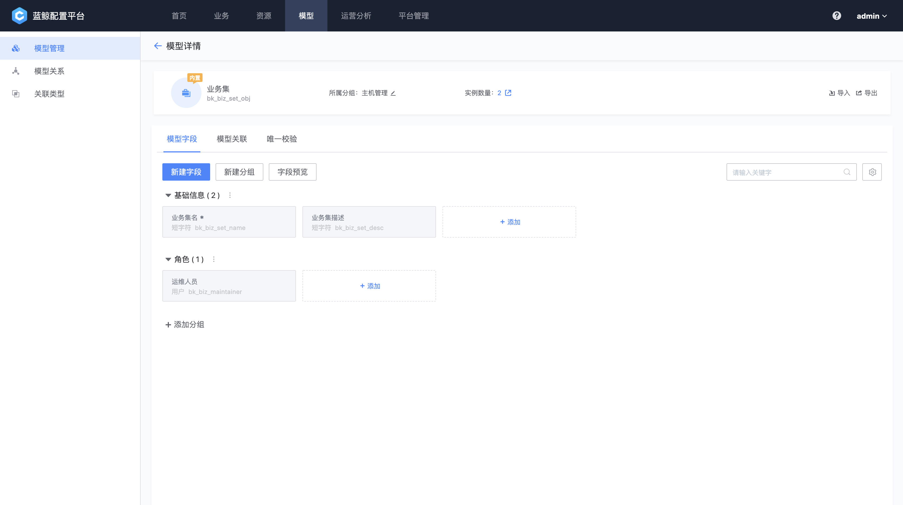
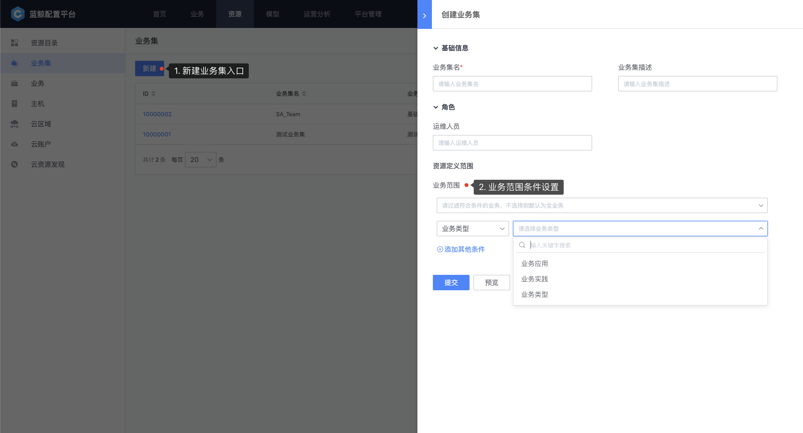
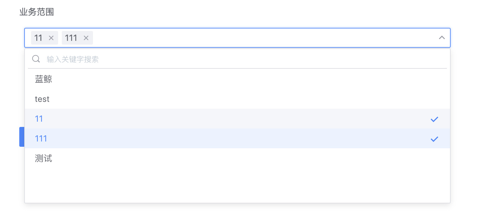
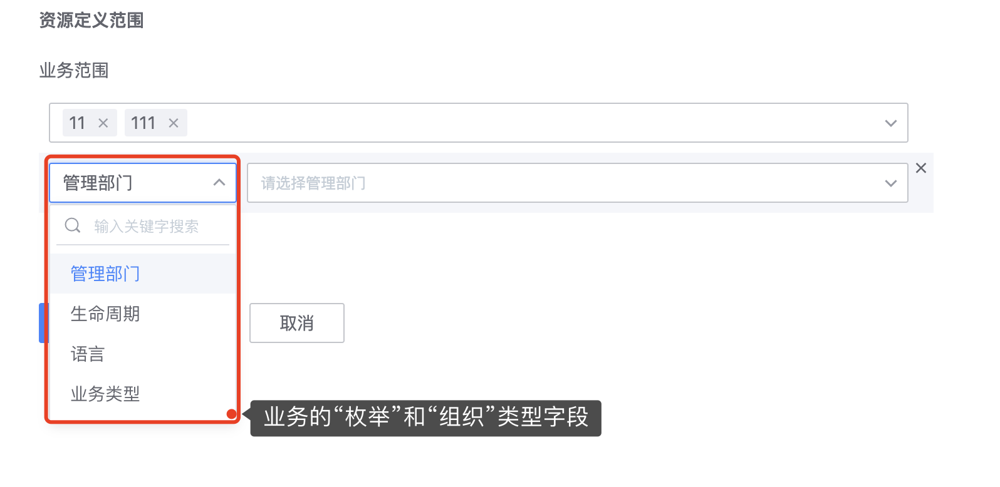
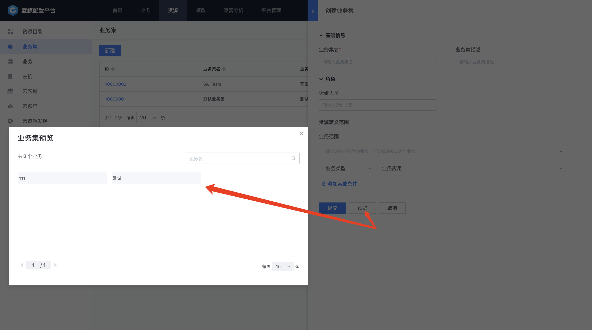
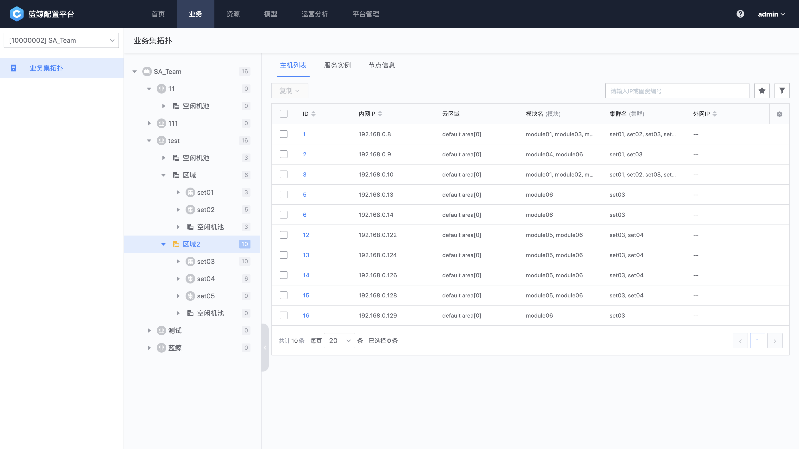

# 业务集

“业务集”是由一个或多个业务组合的资源空间，它与业务有直接的上下层关系；常见的管理使用场景多为公共平台职能团队，如数据库运维团队、中间件运维团队、基础运维团队等等；这些职能团队是跳脱在业务层之上的管理场景，通过“业务集”对符合属性条件的业务里的主机进行跨业务维度的消费。

## 模型

页面路径：`模型` - `模型管理` - `业务集`

“业务集”作为内置模型，默认在 `主机管理` 的模型分组中；初始化后有三个字段分别为：`业务集名` `业务集描述` 和 `运维人员`，用户可以根据需要自行在该模型中添加相应的字段配置。

## 模型实例

页面路径：`资源` - `业务集`

- 业务集名

   业务集的名称

- 业务集描述

   用于填写描述业务集的背景、用途等信息

- 运维人员

   负责运维该业务集的人员名单

- 业务范围

   该业务集包含的业务范围，默认全部（动态，即后续新增的业务都会包含在内）
   
   也可手动勾选指定业务的列表（多选）
   
   
   
   或通过业务的 `组织` 和 `枚举` 字段组合条件来动态获取
   
   
   
- 预览

   在创建过程或列表中，可通过 `预览` 查看业务集包含的业务列表，如下：
   

## 管理空间

页面路径：`业务` - `选择业务 / 业务集`

“业务集”和业务同样在“业务”的一级导航下，提供了与业务相同的拓扑和主机查看能力（但不支持编辑）；

- 业务集拓扑

   提供业务集包含的业务的拓扑集合，并可以查看全部或每个拓扑节点下的主机和服务实例
   
- 其他

   除此之外，业务集在作业平台中也同样提供了和业务一样的管理空间，用户可在业务集下享受同样的能力来跨业务管控更多的主机。