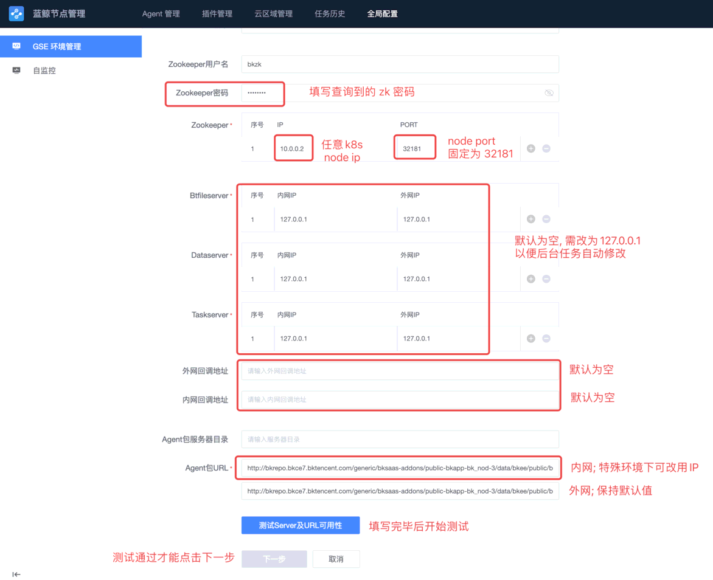
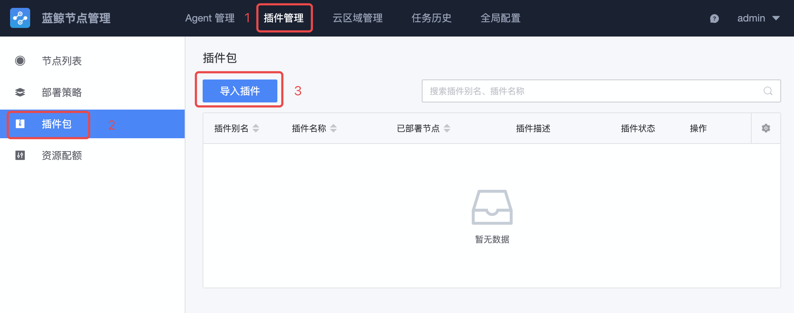

我们已经提供了“一键脚本”，可以完成本文档的大部分内容，建议先阅读《[基础套餐部署](install-bkce.md)》文档。

# 手动部署基础套餐 SaaS

## 在 PaaS 界面配置 Redis 资源池
添加 SaaS 使用的 Redis 资源池。如果部署 SaaS 时提示 “分配不到 redis”，则需补充资源实例。

>**提示**
>
>目前 Redis 资源池分为 2 类：
>- `0shared`：共享实例。池内实例允许重复以供多个 SaaS 复用。由 SaaS 自主规避 `key` 冲突。
>- `1exclusive`：独占实例。池内实例不应该重复，否则可能因为 `key` 冲突而影响 SaaS 运行。

先登录「开发者中心」。访问 `http://bkpaas.$BK_DOMAIN` （需替换 `$BK_DOMAIN` 为您配置的蓝鲸基础域名。）

访问蓝鲸 PaaS Admin（如果未登录则无法访问）： `http://bkpaas.$BK_DOMAIN/backend/admin42/platform/pre-created-instances/manage` 。

在 「`0shared`」这行点击 「添加实例」，重复添加 5 - 10 次（蓝鲸基础套餐会占用 4 个实例，余量可供后续安装的 SaaS 使用）。如需保障 SaaS 性能，可使用自建的 Redis 服务（需确保 k8s node 可访问）。


启用 “可回收复用” 开关，并在 “实例配置” 贴入配置代码，在 **中控机** 执行如下命令生成：
``` bash
redis_json_tpl='{"host":"%s","port": %d,"password":"%s"}'
redis_host="bk-redis-master.blueking.svc.cluster.local"  # 默认用蓝鲸默认的redis，可自行修改
redis_port=6379  # 按需修改
redis_pass=$(kubectl get secret --namespace blueking bk-redis \
  -o jsonpath="{.data.redis-password}" | base64 --decode)  # 读取默认redis的密码，按需修改赋值语句
printf "$redis_json_tpl\n" "$redis_host" "$redis_port" "$redis_pass" | jq .  # 格式化以确保json格式正确
```
命令输出如下图所示：

浏览器界面如下图所示：


## 部署 S-Mart 包
SaaS 应用采用 `S-Mart` 包分发，这里描述了通用的部署方法。

登录 「蓝鲸工作台」，在顶部导航栏里打开 「开发者中心」 ，点击 「创建应用」，选择 「S-mart 应用」 ，上传包。

上传成功后，点击 「部署应用」。


如果存在部署前配置（如 环境变量），需参考对应 SaaS 的部署文档先配置，配置完成后部署才会生效。

先确认顶部的 「模块」 为需要部署的模块，然后切换下方面板到 「生产环境」，选择刚才上传的版本点击 「部署至生产环境」 按钮。此时开始显示部署进度。


<a id="saas-res-download" name="saas-res-download"></a>

## 需要提前下载的资源
我们汇总整理了接下来需要您下载的文件。

1. GSE 插件集合包，用于 [节点管理上传 gse 插件包](#post-install-bk-nodeman-gse-plugin)
    - MD5： 63f3e6c1c1b3e603d33ed2da95187a1f
    - 下载地址：https://bkopen-1252002024.file.myqcloud.com/gse_plugins/gse_plugins-20220507.tgz

如使用 “一键部署” 脚本部署 SaaS，则可跳过如下文件:
1. SaaS 集合包，用于 [部署 SaaS](#deploy-bkce-saas)
    - MD5： 756a093bb030fc6902339623c1dfeac0
    - 下载地址：https://bkopen-1252002024.file.myqcloud.com/ce7/ce7.0.1_saas.tgz
2. GSE Agent 集合包，用于 [节点管理 agent 资源上传](#post-install-bk-nodeman-gse-client)
    - MD5： 9a2d4f3d0034ea37a6c5cb8f7c4e399a
    - 下载地址：https://bkopen-1252002024.file.myqcloud.com/ce7/gse_client_ce_3.6.16.zip
3. Python 3.6，用于 [节点管理 agent 资源上传](#post-install-bk-nodeman-gse-client)
    - MD5： 7f9217b406703e3e3ee88681dd903bd1
    - 下载地址：https://bkopen-1252002024.file.myqcloud.com/common/py36.tgz

<a id="deploy-bkce-saas" name="deploy-bkce-saas"></a>

## 各 SaaS 部署过程
>**提示**
>
>解压刚才下载的 SaaS 集合包，即可得到各个 SaaS 安装所需的 `S-Mart` 包。

### 部署流程服务（bk_itsm）

SaaS 包名：`bk_itsm_V*.tar.gz`

无部署前配置，部署 `default` 模块即可。

部署步骤请参考 **部署 S-Mart 包** 章节。

### 部署进程配置管理（bk_gsekit）

SaaS 包名：`bk_gsekit-V*.tar.gz`

无部署前配置，部署 `default` 模块即可。

### 部署标准运维（bk_sops）

SaaS 包名：`bk_sops-V*.tar.gz`

无部署前配置，共有 **四个模块** 需要部署。

需要先部署 `default` ，然后才能部署 `api`、`pipeline`、`callback` 等 3 个模块（无顺序要求，可同时部署）。


### 部署蓝鲸可视化平台（bk_lesscode）

SaaS 包名：`bk_lesscode-ee-V*.tar.gz`

先配置 「环境变量」，然后部署 `default` 模块即可。

配置 **环境变量**：

进入 「应用引擎」 - 「环境配置」页面，在「环境变量配置」下方填写环境变量并点击「添加」按钮。

注意环境变量的作用范围，可以直接选所有环境

|环境变量名称 |VALUE |描述 |
| -- | -- | -- |
|`PRIVATE_NPM_REGISTRY` |按以下模板填写: `${bkrepoConfig.endpoint}/npm/bkpaas/npm/` , 其中 bkrepoConfig.endpoint 为 bkrepo 服务的网关地址,即http://bkrepo.$BK_DOMAIN |npm 镜像源地址 |
|`PRIVATE_NPM_USERNAME` |填写部署 PaaS3.0 时配置的 `bkrepoConfig.lesscodeUsername` 默认值是 bklesscode |npm 账号用户名 |
|`PRIVATE_NPM_PASSWORD` |填写部署 PaaS3.0 时配置的 `bkrepoConfig.lesscodePassword` 默认值是 blueking |npm 账号密码 |
|`BKAPIGW_DOC_URL` |填写部署 API 网关时，生成的环境变量 APISUPPORT_FE_URL 的值 默认值是 `http://apigw.$BK_DOMAIN/docs` |云 API 文档地址 |

最终配置界面如下图所示：

部署应用到所需的环境


### 部署节点管理（bk_nodeman）

SaaS 包名：`bk_nodeman-V*.tar.gz`

先配置 「环境变量」，共有 **两个模块** 需要部署。

在各自模块提前配置以下 3 个环境变量 ：

|环境变量名称 |VALUE |描述 |
|--|--|--|
|STORAGE_TYPE |BLUEKING_ARTIFACTORY |存储类型 |
|BKAPP_RUN_ENV |ce |运行环境 |
|BKAPP_NODEMAN_CALLBACK_URL |http://apps.$BK_DOMAIN/prod--backend--bk--nodeman/backend |节点管理回调地址 |

>**提示**:
>
>1. 配置一次 `default` 模块的变量后，`backend` 的变量可以从 `default` 模块导入。
>2. 环境变量的作用范围，可以直接选所有环境。


需要先部署 `default` ，然后部署 `backend` 模块。


<a id="post-install-bk-saas" name="post-install-bk-saas"></a>

## SaaS 部署后的设置
>**提示**
>
>一些 SaaS 在部署成功后，还需要做初始化设置。


<a id="post-install-bk-lesscode" name="post-install-bk-lesscode"></a>

### 蓝鲸可视化平台（bk_lesscode）部署后配置
目前 bk_lesscode 只支持通过独立域名来访问。

在 bk_lesscode 应用页中, 点击 「应用引擎」-「访问入口」中配置独立域名并保存。
如果没有配置公网 DNS 解析，则在本地 hosts 需要加上
1.1.1.1（ `bk-ingress-controller` pod 所在机器的公网 IP） `lesscode.$BK_DOMAIN`

在应用推广-发布管理中，将应用市场的访问地址类型设置为：主模块生产环境独立域名


<a id="post-install-bk-nodeman" name="post-install-bk-nodeman"></a>

### 节点管理（bk_nodeman）部署后配置

<a id="post-install-bk-nodeman-gse-env" name="post-install-bk-nodeman-gse-env"></a>

#### 配置 GSE 环境管理
进入 “全局配置”->“gse 环境管理” 界面。

点击 “默认接入点” 右侧的 “编辑” 图标，进入 “编辑接入点” 界面。

填写要求如下：

zookeeper 集群地址填写 **任意 k8s node IP**，端口填写 `32181` （注意不是默认的 `2181`）。用户名和密码可执行如下命令获取 auth 字符串，其格式为 `用户名:密码`。
``` bash
kubectl get -n blueking cm bk-gse-ce-task-config -o go-template --template '{{index .data "task.conf" }}' | jq -r ".zkauth"
```

Btserver、dataserver、taskserver 的 **内网 IP** 及 **外网 IP** 地址默认为空，必须填写。可暂且填入 `127.0.0.1` ，这样后台任务会优先使用从 zk 中读取的服务地址。

agent url: 一般无需修改，默认通过域名访问 bkrepo 下载安装包。如果用户环境不具备配置 DNS 的条件，可使用 IP 直接访问 bkrepo。将默认值里的 `http://bkrepo.$BK_DOMAIN/` 部分换成 `http://node_ip:30025/` （任意 k8s node IP） 后面目录路径保持不变。`30025` 是 bkrepo 暴露的 NodePort。

最终配置界面如下图所示：


点击 “测试 Server 及 URL 可用性”，然后点击 “下一步”。在新的 agent 信息界面点击 “确认” 保存。

回到查看界面后，请 **等待 1 ~ 2 分钟**，然后刷新此页面。如果 Btserver，dataserver，taskserver 的地址自动从 `127.0.0.1` 变更为 node 的内网 IP ，则说明读取 zookeeper 成功，否则需检查 zookeeper 的 IP、 端口以及账户密码是否正确。


<a id="post-install-bk-nodeman-gse-plugin" name="post-install-bk-nodeman-gse-plugin"></a>

#### 上传 gse 插件包
打开 “工作台” —— “蓝鲸节点管理”。切换顶部导航到 “插件管理”，选择左侧菜单栏里的 “插件包”。


在您的电脑上解压 [提前下载](#saas-res-download) 的 “GSE 插件集合包”。

单独上传里面的子包。上传成功后，点击 “下一步” 进入 “插件包解析” 界面，全选后 “导入” 即可。
>**提示**
>
>当前节点管理在插件包解析界面有 bug，“支持系统” 列只显示了架构，未显示操作系统。因此看起来插件有重复。请放心全选导入。

插件集合包中各子包的用途：
| 插件包名 | 用途 | 描述 |
| -- | -- | -- |
| bkmonitorbeat | 蓝鲸监控指标采集器 | 蓝鲸监控拨测采集器 支持多协议多任务的采集，监控和可用率计算，提供多种运行模式和热加载机制 |
| bkmonitorproxy | 自定义上报服务 | 自定义数据上报服务，用来收集用户自定义上报的时序数据，或事件数据。 |
| bkunifylogbeat | 高性能日志采集 | 数据平台，蓝鲸监控，日志检索等和日志相关的数据. 首次使用插件管理进行操作前，先到日志检索/数据平台等进行设置插件的功能项 |
| gsecmdline | 自定义上报命令行工具 | 蓝鲸监控脚本采集，自定义监控，数据平台自定义上报数据 |


>**提示**
>
>`bkmonitorbeat-2.x` 完成了采集功能的统一，故新版插件集合包中移除了下列包：
>| 包名 | 用途 | 描述 |
>| -- | -- | -- |
>| exceptionbeat | 系统事件采集器 | 系统事件采集器，用来收集系统事件如磁盘只读，corefile 产生等。 |
>| basereport | 基础性能采集器 | 负责采集 CMDB 上的实时数据，蓝鲸监控里的主机监控，包含 CPU，内存，磁盘等 |
>| processbeat | 主机进程信息采集器 | 蓝鲸监控主机监控里面的进程信息. 首次使用插件管理进行操作前，先到蓝鲸监控进行设置插件的功能项 |


<a id="post-install-bk-nodeman-gse-client" name="post-install-bk-nodeman-gse-client"></a>

#### agent 资源上传
>**提示**
>
>“一键部署” 脚本中自动完成了此步骤，可以跳过本章节。

在您的电脑上解压 [提前下载](#saas-res-download) 的 “GSE Agent 集合包” 后，分别上传 agent 包到 bkrepo 中（ `bkrepo.$BK_DOMAIN` 登陆账号密码可以通过： `helm status -n blueking bk-repo` 获取。先找到 `bksaas-addons` 项目，节点管理对应的目录（public-bkapp-bk_nod-x/data/bkee/public/bknodeman/download ），每次只能上传一个包，需要分多次上传。


下载 py36 解释器包，部署 gse proxy 安装 gse p-agent 需要用到：[https://bkopen-1252002024.file.myqcloud.com/common/py36.tgz](https://bkopen-1252002024.file.myqcloud.com/common/py36.tgz) 上传到和第一步 agent 的同级目录。
